# System Flows — Maxius Platform

Dokumen ini menjelaskan alur kerja utama dalam Maxius Platform dengan diagram Mermaid.

---

## 1. Authentication Flow

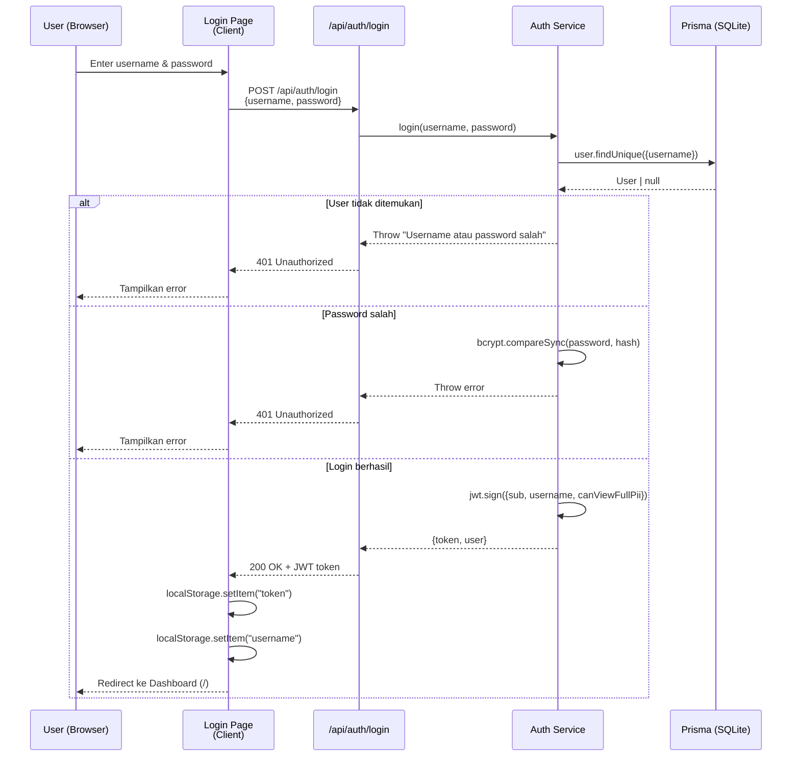
```mermaid
sequenceDiagram
    participant U as User (Browser)
    participant L as Login Page<br/>(Client)
    participant API as /api/auth/login
    participant S as Auth Service
    participant DB as Prisma (SQLite)

    U->>L: Enter username & password
    L->>API: POST /api/auth/login<br/>{username, password}
    API->>S: login(username, password)
    S->>DB: user.findUnique({username})
    DB-->>S: User | null
    alt User tidak ditemukan
        S-->>API: Throw "Username atau password salah"
        API-->>L: 401 Unauthorized
        L-->>U: Tampilkan error
    else Password salah
        S->>S: bcrypt.compareSync(password, hash)
        S-->>API: Throw error
        API-->>L: 401 Unauthorized
        L-->>U: Tampilkan error
    else Login berhasil
        S->>S: jwt.sign({sub, username, canViewFullPii})
        S-->>API: {token, user}
        API-->>L: 200 OK + JWT token
        L->>L: localStorage.setItem("token")
        L->>L: localStorage.setItem("username")
        L-->>U: Redirect ke Dashboard (/)
    end
```

### Penjelasan
- **Entry**: `app/(auth)/login/page.tsx` → `POST /api/auth/login`
- **Guard**: Client-side check di `app/(dashboard)/layout.tsx` — jika tidak ada token di localStorage, redirect ke `/login`
- **Server-side guard**: `withAuth()` HOC di `lib/utils/api.ts` — verifikasi JWT di setiap protected API route
- **Token expiry**: 8 jam
- **Legacy handling**: Token lama tanpa `canViewFullPii` → default `true` (full access)

---

## 2. Webhook TikTok Shop (Stock Sync)

### 2a. Main Webhook Flow

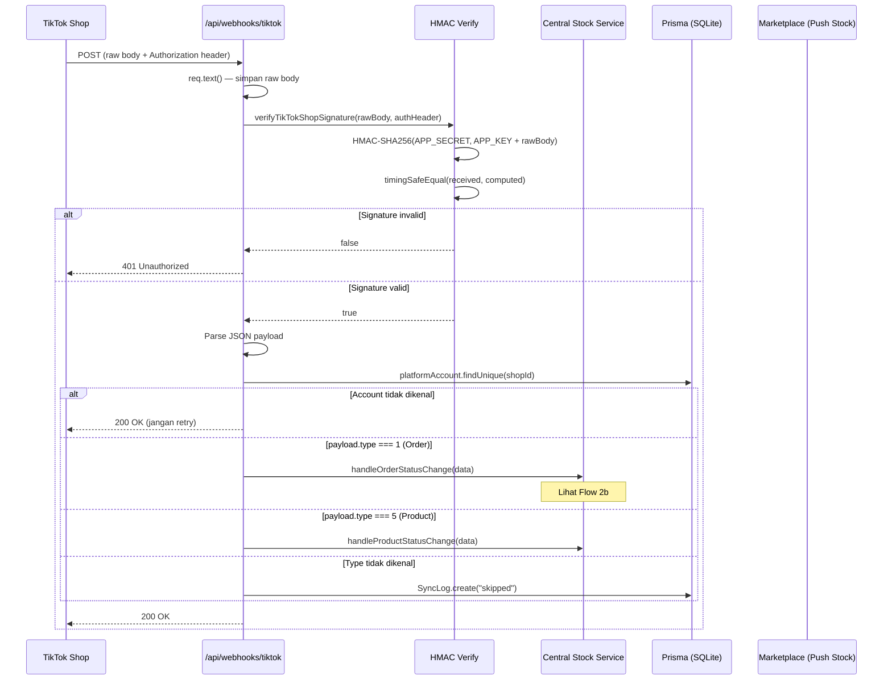
```mermaid
sequenceDiagram
    participant TT as TikTok Shop
    participant WH as /api/webhooks/tiktok
    participant V as HMAC Verify
    participant S as Central Stock Service
    participant DB as Prisma (SQLite)
    participant MP as Marketplace (Push Stock)

    TT->>WH: POST (raw body + Authorization header)
    WH->>WH: req.text() — simpan raw body
    WH->>V: verifyTikTokShopSignature(rawBody, authHeader)
    V->>V: HMAC-SHA256(APP_SECRET, APP_KEY + rawBody)
    V->>V: timingSafeEqual(received, computed)
    alt Signature invalid
        V-->>WH: false
        WH-->>TT: 401 Unauthorized
    else Signature valid
        V-->>WH: true
        WH->>WH: Parse JSON payload
        WH->>DB: platformAccount.findUnique(shopId)
        alt Account tidak dikenal
            WH-->>TT: 200 OK (jangan retry)
        else payload.type === 1 (Order)
            WH->>S: handleOrderStatusChange(data)
            Note over S: Lihat Flow 2b
        else payload.type === 5 (Product)
            WH->>S: handleProductStatusChange(data)
        else Type tidak dikenal
            WH->>DB: SyncLog.create("skipped")
        end
        WH-->>TT: 200 OK
    end
```

### 2b. Order Status Change Handler

```mermaid
flowchart TD
    A[Webhook: order_status change] --> B{Order exists<br/>di DB?}
    B -->|Tidak| C[SyncLog: "run /api/orders/sync manual"]
    C --> Z[Kembalikan 200 OK]
    B -->|Ya| D{Idempotency Check:<br/>update_time <= lastWebhook?}
    D -->|Ya| E[Skip — stale/out-of-order]
    D -->|Tidak| F[Update order status<br/>+ lastWebhookUpdateTime]
    F --> G{Status = AWAITING_SHIPMENT?}
    G -->|Ya| H[deductStockForOrder]
    G -->|Tidak| I{Status = CANCELLED?}
    I -->|Ya| J[restoreStockForCanceledOrder]
    I -->|Tidak| K[Selesai]
    H --> L[Push stock ke<br/>marketplace lain]
    J --> L
    L --> Z
```

### 2c. Stock Deduction (Idempotent)

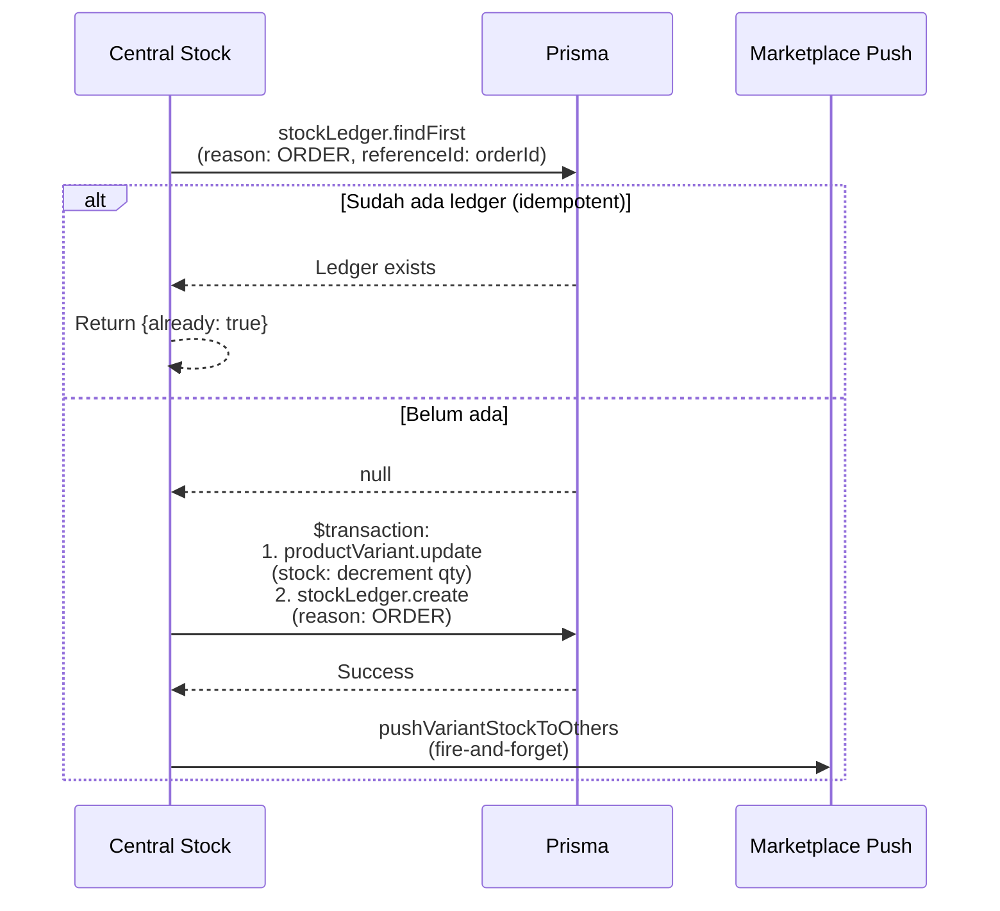
```mermaid
sequenceDiagram
    participant CS as Central Stock
    participant DB as Prisma
    participant MP as Marketplace Push

    CS->>DB: stockLedger.findFirst<br/>(reason: ORDER, referenceId: orderId)
    alt Sudah ada ledger (idempotent)
        DB-->>CS: Ledger exists
        CS-->>CS: Return {already: true}
    else Belum ada
        DB-->>CS: null
        CS->>DB: $transaction:<br/>1. productVariant.update<br/>(stock: decrement qty)<br/>2. stockLedger.create<br/>(reason: ORDER)
        DB-->>CS: Success
        CS->>MP: pushVariantStockToOthers<br/>(fire-and-forget)
    end
```

### 2d. Push Stock ke Marketplace

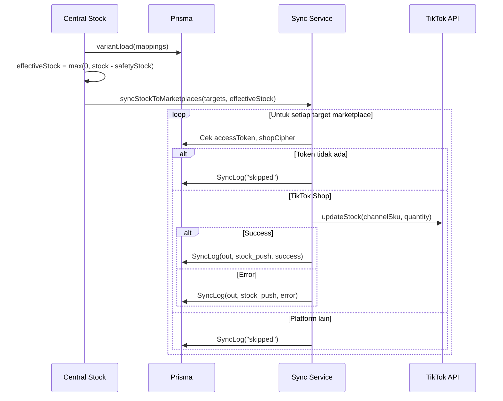
```mermaid
sequenceDiagram
    participant CS as Central Stock
    participant DB as Prisma
    participant SYNC as Sync Service
    participant TT as TikTok API

    CS->>DB: variant.load(mappings)
    CS->>CS: effectiveStock = max(0, stock - safetyStock)
    CS->>SYNC: syncStockToMarketplaces(targets, effectiveStock)
    loop Untuk setiap target marketplace
        SYNC->>DB: Cek accessToken, shopCipher
        alt Token tidak ada
            SYNC->>DB: SyncLog("skipped")
        else TikTok Shop
            SYNC->>TT: updateStock(channelSku, quantity)
            alt Success
                SYNC->>DB: SyncLog(out, stock_push, success)
            else Error
                SYNC->>DB: SyncLog(out, stock_push, error)
            end
        else Platform lain
            SYNC->>DB: SyncLog("skipped")
        end
    end
```

---

## 3. Order Sync (TikTok API → Maxius)

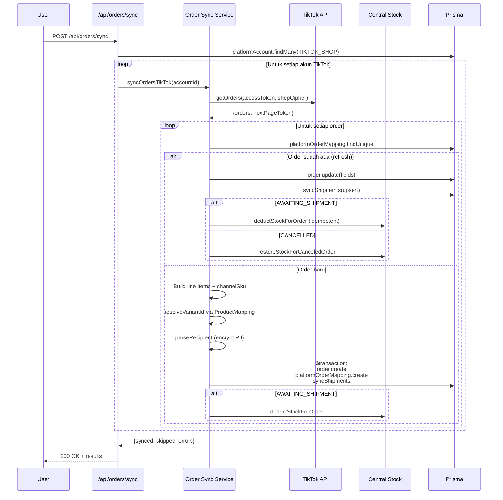
```mermaid
sequenceDiagram
    participant U as User
    participant API as /api/orders/sync
    participant S as Order Sync Service
    participant TT as TikTok API
    participant CS as Central Stock
    participant DB as Prisma

    U->>API: POST /api/orders/sync
    API->>DB: platformAccount.findMany(TIKTOK_SHOP)
    loop Untuk setiap akun TikTok
        API->>S: syncOrdersTikTok(accountId)
        S->>TT: getOrders(accessToken, shopCipher)
        TT-->>S: {orders, nextPageToken}
        loop Untuk setiap order
            S->>DB: platformOrderMapping.findUnique
            alt Order sudah ada (refresh)
                S->>DB: order.update(fields)
                S->>DB: syncShipments(upsert)
                alt AWAITING_SHIPMENT
                    S->>CS: deductStockForOrder (idempotent)
                else CANCELLED
                    S->>CS: restoreStockForCanceledOrder
                end
            else Order baru
                S->>S: Build line items + channelSku
                S->>S: resolveVariantId via ProductMapping
                S->>S: parseRecipient (encrypt PII)
                S->>DB: $transaction:<br/>order.create<br/>platformOrderMapping.create<br/>syncShipments
                alt AWAITING_SHIPMENT
                    S->>CS: deductStockForOrder
                end
            end
        end
    end
    S-->>API: {synced, skipped, errors}
    API-->>U: 200 OK + results
```

---

## 4. Ship Package (Fulfillment)

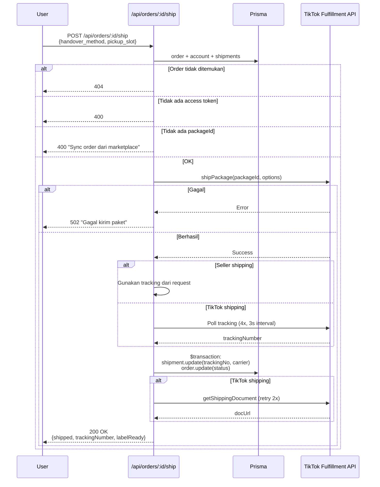
```mermaid
sequenceDiagram
    participant U as User
    participant API as /api/orders/:id/ship
    participant DB as Prisma
    participant TT as TikTok Fulfillment API

    U->>API: POST /api/orders/:id/ship<br/>{handover_method, pickup_slot}
    API->>DB: order + account + shipments
    alt Order tidak ditemukan
        API-->>U: 404
    else Tidak ada access token
        API-->>U: 400
    else Tidak ada packageId
        API-->>U: 400 "Sync order dari marketplace"
    else OK
        API->>TT: shipPackage(packageId, options)
        alt Gagal
            TT-->>API: Error
            API-->>U: 502 "Gagal kirim paket"
        else Berhasil
            TT-->>API: Success
            alt Seller shipping
                API->>API: Gunakan tracking dari request
            else TikTok shipping
                API->>TT: Poll tracking (4x, 3s interval)
                TT-->>API: trackingNumber
            end
            API->>DB: $transaction:<br/>shipment.update(trackingNo, carrier)<br/>order.update(status)
            alt TikTok shipping
                API->>TT: getShippingDocument (retry 2x)
                TT-->>API: docUrl
            end
            API-->>U: 200 OK<br/>{shipped, trackingNumber, labelReady}
        end
    end
```

---

## 5. Bulk Label Merge (PDF)

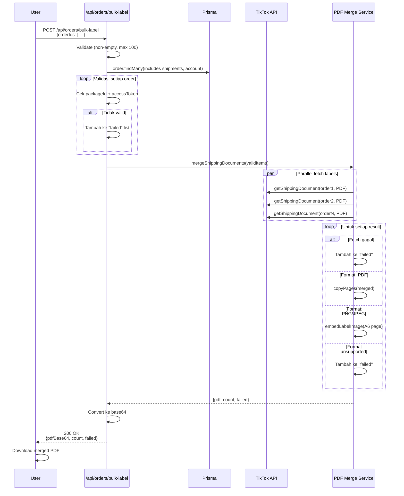
```mermaid
sequenceDiagram
    participant U as User
    participant API as /api/orders/bulk-label
    participant DB as Prisma
    participant TT as TikTok API
    participant PDF as PDF Merge Service

    U->>API: POST /api/orders/bulk-label<br/>{orderIds: [...]}
    API->>API: Validate (non-empty, max 100)
    API->>DB: order.findMany(includes shipments, account)
    loop Validasi setiap order
        API->>API: Cek packageId + accessToken
        alt Tidak valid
            API->>API: Tambah ke "failed" list
        end
    end
    API->>PDF: mergeShippingDocuments(validItems)
    par Parallel fetch labels
        PDF->>TT: getShippingDocument(order1, PDF)
        PDF->>TT: getShippingDocument(order2, PDF)
        PDF->>TT: getShippingDocument(orderN, PDF)
    end
    loop Untuk setiap result
        alt Fetch gagal
            PDF->>PDF: Tambah ke "failed"
        else Format: PDF
            PDF->>PDF: copyPages(merged)
        else Format: PNG/JPEG
            PDF->>PDF: embedLabelImage(A6 page)
        else Format unsupported
            PDF->>PDF: Tambah ke "failed"
        end
    end
    PDF-->>API: {pdf, count, failed}
    API->>API: Convert ke base64
    API-->>U: 200 OK<br/>{pdfBase64, count, failed}
    U->>U: Download merged PDF
```

---

## 6. PII Protection Flow

### 6a. Write-time (Order Sync)

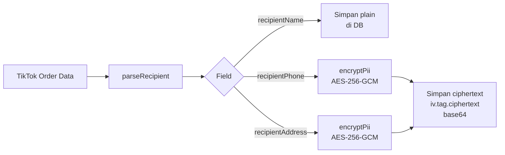
```mermaid
flowchart LR
    A[TikTok Order Data] --> B[parseRecipient]
    B --> C{Field}
    C -->|recipientName| D[Simpan plain<br/>di DB]
    C -->|recipientPhone| E[encryptPii<br/>AES-256-GCM]
    C -->|recipientAddress| F[encryptPii<br/>AES-256-GCM]
    E --> G[Simpan ciphertext<br/>iv.tag.ciphertext<br/>base64]
    F --> G
```

### 6b. Read-time (Order Detail)

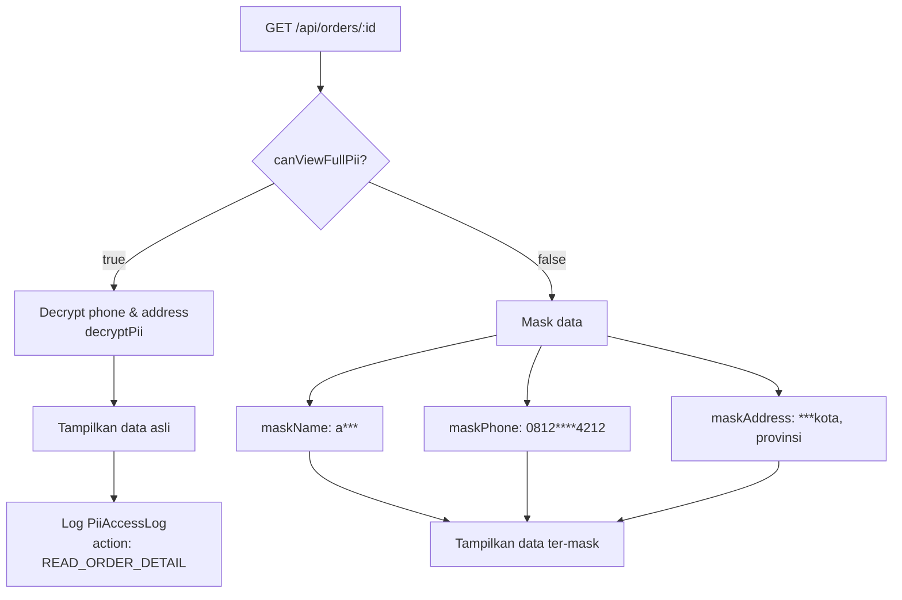
```mermaid
flowchart TD
    A[GET /api/orders/:id] --> B{canViewFullPii?}
    B -->|true| C[Decrypt phone & address<br/>decryptPii]
    C --> D[Tampilkan data asli]
    D --> E[Log PiiAccessLog<br/>action: READ_ORDER_DETAIL]
    B -->|false| F[Mask data]
    F --> G[maskName: a***]
    F --> H[maskPhone: 0812****4212]
    F --> I[maskAddress: ***kota, provinsi]
    G --> J[Tampilkan data ter-mask]
    H --> J
    I --> J
```

### 6c. Masking Rules

| Field | Rule | Contoh |
|---|---|---|
| Nama | Karakter pertama + asterisk (max 6) | `Budi` → `B*****` |
| Email | Local part di-mask | `budi@mail.com` → `b***@mail.com` |
| HP | 4 awal + `****` + 4 akhir | `081234567890` → `0812****7890` |
| Alamat | 2 segmen terakhir dipertahankan | `Jl. Sudirman 10, Jakarta, DKI` → `***Jakarta, DKI` |

### 6d. Retention (90 Hari)

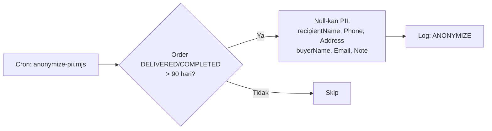
```mermaid
flowchart LR
    A[Cron: anonymize-pii.mjs] --> B{Order DELIVERED/COMPLETED<br/>> 90 hari?}
    B -->|Ya| C[Null-kan PII:<br/>recipientName, Phone, Address<br/>buyerName, Email, Note]
    C --> D[Log: ANONYMIZE]
    B -->|Tidak| E[Skip]
```

---

## 7. Stock Opname (Manual Adjustment)

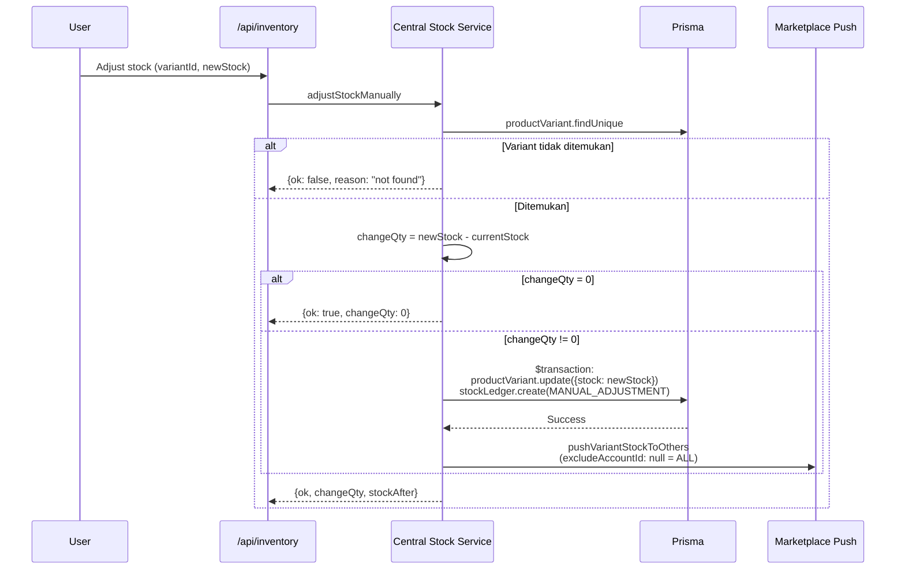
```mermaid
sequenceDiagram
    participant U as User
    participant API as /api/inventory
    participant S as Central Stock Service
    participant DB as Prisma
    participant MP as Marketplace Push

    U->>API: Adjust stock (variantId, newStock)
    API->>S: adjustStockManually
    S->>DB: productVariant.findUnique
    alt Variant tidak ditemukan
        S-->>API: {ok: false, reason: "not found"}
    else Ditemukan
        S->>S: changeQty = newStock - currentStock
        alt changeQty = 0
            S-->>API: {ok: true, changeQty: 0}
        else changeQty != 0
            S->>DB: $transaction:<br/>productVariant.update({stock: newStock})<br/>stockLedger.create(MANUAL_ADJUSTMENT)
            DB-->>S: Success
            S->>MP: pushVariantStockToOthers<br/>(excludeAccountId: null = ALL)
        end
        S-->>API: {ok, changeQty, stockAfter}
    end
```

---

## 8. Stock Ledger Reason Codes

| Code | Keterangan | Trigger |
|---|---|---|
| `ORDER` | Stok dikurangi saat order masuk | Webhook `AWAITING_SHIPMENT` / Order sync |
| `ORDER_CANCELLED` | Stok dikembalikan saat order dibatalkan | Webhook `CANCELLED` / Order sync |
| `ORDER_REFUNDED` | Stok dikembalikan saat refund | Webhook status refund |
| `SALE` | Penjualan langsung (legacy) | Legacy webhook `/api/webhooks/:accountId` |
| `MANUAL_ADJUSTMENT` | Koreksi manual (stock opname) | User adjustment |
| `SYNC_CORRECTION` | Koreksi sinkronisasi | Reconciliation job |
| `INIT` | Inisialisasi stok awal | Seed / first-time setup |

---

## 9. High-Level System Architecture

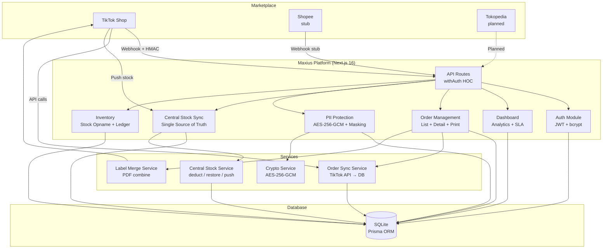
```mermaid
graph TB
    subgraph "Marketplace"
        TT[TikTok Shop]
        SH[Shopee<br/>stub]
        TK[Tokopedia<br/>planned]
    end

    subgraph "Maxius Platform (Next.js 16)"
        direction TB
        AUTH[Auth Module<br/>JWT + bcrypt]
        DASH[Dashboard<br/>Analytics + SLA]
        ORD[Order Management<br/>List + Detail + Print]
        STK[Central Stock Sync<br/>Single Source of Truth]
        PII[PII Protection<br/>AES-256-GCM + Masking]
        INV[Inventory<br/>Stock Opname + Ledger]
        API[API Routes<br/>withAuth HOC]
    end

    subgraph "Database"
        DB[(SQLite<br/>Prisma ORM)]
    end

    subgraph "Services"
        CS[Central Stock Service<br/>deduct / restore / push]
        OS[Order Sync Service<br/>TikTok API → DB]
        LM[Label Merge Service<br/>PDF combine]
        CRYPTO[Crypto Service<br/>AES-256-GCM]
    end

    TT -->|Webhook + HMAC| API
    TT -->|API calls| OS
    TT -->|Push stock| STK
    SH -->|Webhook stub| API
    TK -.->|Planned| API

    API --> AUTH
    API --> DASH
    API --> ORD
    API --> STK
    API --> PII
    API --> INV

    AUTH --> DB
    DASH --> DB
    ORD --> DB
    STK --> DB
    PII --> DB
    INV --> DB

    STK --> CS
    ORD --> OS
    ORD --> LM
    PII --> CRYPTO
    CS --> DB
    OS --> DB
    LM --> TT
```

---

## 10. Data Flow: Stock Changes

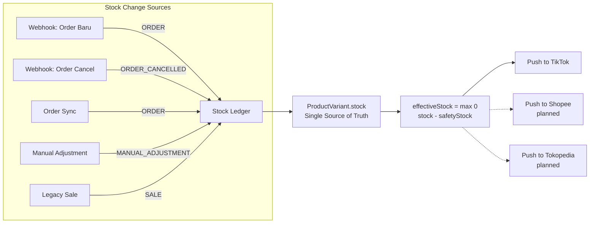
```mermaid
graph LR
    subgraph "Stock Change Sources"
        A[Webhook: Order Baru] -->|ORDER| LEDGER[Stock Ledger]
        B[Webhook: Order Cancel] -->|ORDER_CANCELLED| LEDGER
        C[Order Sync] -->|ORDER| LEDGER
        D[Manual Adjustment] -->|MANUAL_ADJUSTMENT| LEDGER
        E[Legacy Sale] -->|SALE| LEDGER
    end

    LEDGER --> F[ProductVariant.stock<br/>Single Source of Truth]
    F --> G[effectiveStock = max 0<br/>stock - safetyStock]
    G --> H[Push to TikTok]
    G -.-> I[Push to Shopee<br/>planned]
    G -.-> J[Push to Tokopedia<br/>planned]
```

---

## 11. Dropdown "No. Pesanan" — Search Type Selector

### 11a. Search Type Selector Flow

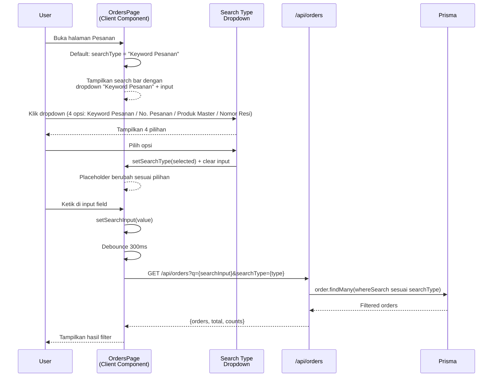
```mermaid
sequenceDiagram
    participant U as User
    participant UI as OrdersPage<br/>(Client Component)
    participant DD as Search Type<br/>Dropdown
    participant API as /api/orders
    participant DB as Prisma

    U->>UI: Buka halaman Pesanan
    UI->>UI: Default: searchType = "Keyword Pesanan"
    UI-->>UI: Tampilkan search bar dengan<br/>dropdown "Keyword Pesanan" + input

    U->>DD: Klik dropdown (4 opsi: Keyword Pesanan / No. Pesanan / Produk Master / Nomor Resi)
    DD-->>U: Tampilkan 4 pilihan
    U->>DD: Pilih opsi
    DD->>UI: setSearchType(selected) + clear input
    UI-->>UI: Placeholder berubah sesuai pilihan

    U->>UI: Ketik di input field
    UI->>UI: setSearchInput(value)
    UI->>UI: Debounce 300ms
    UI->>API: GET /api/orders?q={searchInput}&searchType={type}
    API->>DB: order.findMany(whereSearch sesuai searchType)
    DB-->>API: Filtered orders
    API-->>UI: {orders, total, counts}
    UI-->>U: Tampilkan hasil filter
```

### 11b. Search Type Options

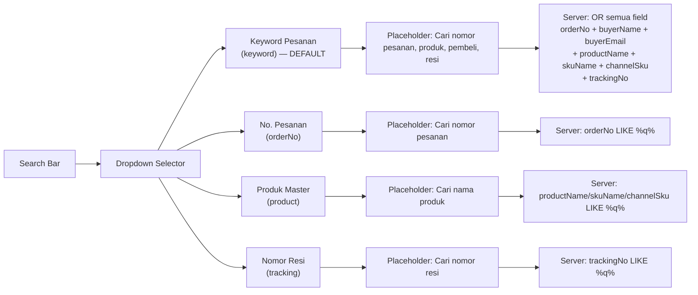
```mermaid
flowchart LR
    A[Search Bar] --> B[Dropdown Selector]
    B --> C["Keyword Pesanan<br/>(keyword) — DEFAULT"]
    B --> D["No. Pesanan<br/>(orderNo)"]
    B --> E["Produk Master<br/>(product)"]
    B --> F["Nomor Resi<br/>(tracking)"]

    C --> G[Placeholder: Cari nomor pesanan, produk, pembeli, resi]
    D --> H[Placeholder: Cari nomor pesanan]
    E --> I[Placeholder: Cari nama produk]
    F --> J[Placeholder: Cari nomor resi]

    G --> K[Server: OR semua field<br/>orderNo + buyerName + buyerEmail<br/>+ productName + skuName + channelSku<br/>+ trackingNo]
    H --> L[Server: orderNo LIKE %q%]
    I --> M[Server: productName/skuName/channelSku LIKE %q%]
    J --> N[Server: trackingNo LIKE %q%]
```

### 11c. Search Behavior Details

| Aspek | Detail |
|---|---|
| **Default** | "Keyword Pesanan" (keyword) — pre-selected saat load |
| **Tipe** | 4 opsi: `keyword`, `orderNo`, `product`, `tracking` |
| **Keyword (luas)** | OR: `orderNo`, `buyerName`, `buyerEmail`, `items.productName`, `items.skuName`, `items.channelSku`, `shipments.trackingNo` |
| **orderNo** | Hanya `orderNo` (containment, case-insensitive) |
| **product** | Hanya `items.productName` / `items.skuName` / `items.channelSku` |
| **tracking** | Hanya `shipments.trackingNo` |
| **Debounce** | 300ms — tunggu jeda pengetikan sebelum fetch |
| **Server-side** | Query `q` + `searchType` di-pass ke `/api/orders` |
| **Reset** | Saat ganti search type → input cleared, query reset ke "" |
| **Pagination** | Reset ke page 1 setiap search berubah |

---

## 12. Order Card Actions

### 12a. Action Bar Overview

```mermaid
flowchart TD
    A[Order Card] --> B[Header]
    A --> C[Body: Product + Qty + Price + Address]
    A --> D[Footer: Catatan + Lokasi]
    A --> E[Action Bar]

    B --> B1[Status Badge]
    B --> B2["Nomor Pesanan: TXXXXXX<br/>(link — placeholder)"]
    B --> B3[Deadline SLA]
    B --> B4[Sync dari Marketplace]
    B --> B5[Toko | Platform Badge]

    E --> F["Detail Pesanan<br/>(FileText icon)"]
    E --> G["Chat Pembeli<br/>(disabled — coming soon)"]
    E --> H["Cetak ▾<br/>(PrintDropdown)"]
    E --> I["OrderProgressSteps<br/>(Picking → Packing → Label → Invoice)"]
    E --> J["Kirim Paket<br/>(jika AWAITING_SHIPMENT)"]
    E --> K["Lacak<br/>(TrackingModal)"]
    E --> L[SLA Badge<br/>(urgent/warning)]
```

### 12b. Per-Card Action Flow

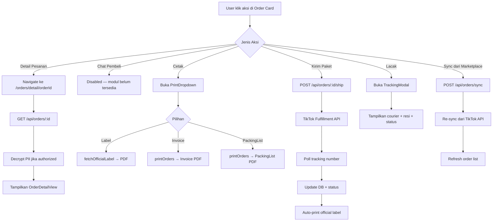
```mermaid
flowchart TD
    A[User klik aksi di Order Card] --> B{Jenis Aksi}

    B -->|Detail Pesanan| C[Navigate ke /orders/detail/orderId]
    C --> C1[GET /api/orders/:id]
    C1 --> C2[Decrypt PII jika authorized]
    C2 --> C3[Tampilkan OrderDetailView]

    B -->|Chat Pembeli| D[Disabled — modul belum tersedia]

    B -->|Cetak| E[Buka PrintDropdown]
    E --> E1{Pilihan}
    E1 -->|Label| F[fetchOfficialLabel → PDF]
    E1 -->|Invoice| G[printOrders → Invoice PDF]
    E1 -->|PackingList| H[printOrders → PackingList PDF]

    B -->|Kirim Paket| I[POST /api/orders/:id/ship]
    I --> I1[TikTok Fulfillment API]
    I1 --> I2[Poll tracking number]
    I2 --> I3[Update DB + status]
    I3 --> I4[Auto-print official label]

    B -->|Lacak| J[Buka TrackingModal]
    J --> J1[Tampilkan courier + resi + status]

    B -->|Sync dari Marketplace| K[POST /api/orders/sync]
    K --> K1[Re-sync dari TikTok API]
    K1 --> K2[Refresh order list]
```

---

## 13. Print Flow (Label / Invoice / Packing List)

### 13a. Single Order Print

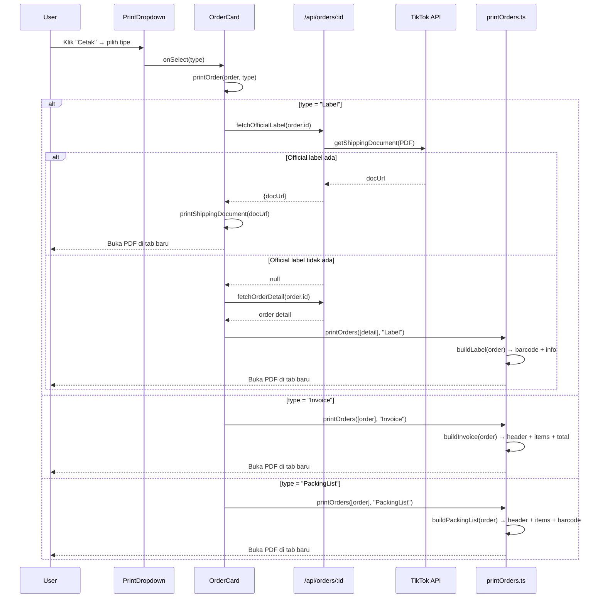
```mermaid
sequenceDiagram
    participant U as User
    participant DD as PrintDropdown
    participant ORD as OrderCard
    participant API as /api/orders/:id
    participant TT as TikTok API
    participant P as printOrders.ts

    U->>DD: Klik "Cetak" → pilih tipe
    DD->>ORD: onSelect(type)
    ORD->>ORD: printOrder(order, type)

    alt type = "Label"
        ORD->>API: fetchOfficialLabel(order.id)
        API->>TT: getShippingDocument(PDF)
        alt Official label ada
            TT-->>API: docUrl
            API-->>ORD: {docUrl}
            ORD->>ORD: printShippingDocument(docUrl)
            ORD-->>U: Buka PDF di tab baru
        else Official label tidak ada
            API-->>ORD: null
            ORD->>API: fetchOrderDetail(order.id)
            API-->>ORD: order detail
            ORD->>P: printOrders([detail], "Label")
            P->>P: buildLabel(order) → barcode + info
            P-->>U: Buka PDF di tab baru
        end

    else type = "Invoice"
        ORD->>P: printOrders([order], "Invoice")
        P->>P: buildInvoice(order) → header + items + total
        P-->>U: Buka PDF di tab baru

    else type = "PackingList"
        ORD->>P: printOrders([order], "PackingList")
        P->>P: buildPackingList(order) → header + items + barcode
        P-->>U: Buka PDF di tab baru
    end
```

### 13b. Bulk Print (Multi-Order)

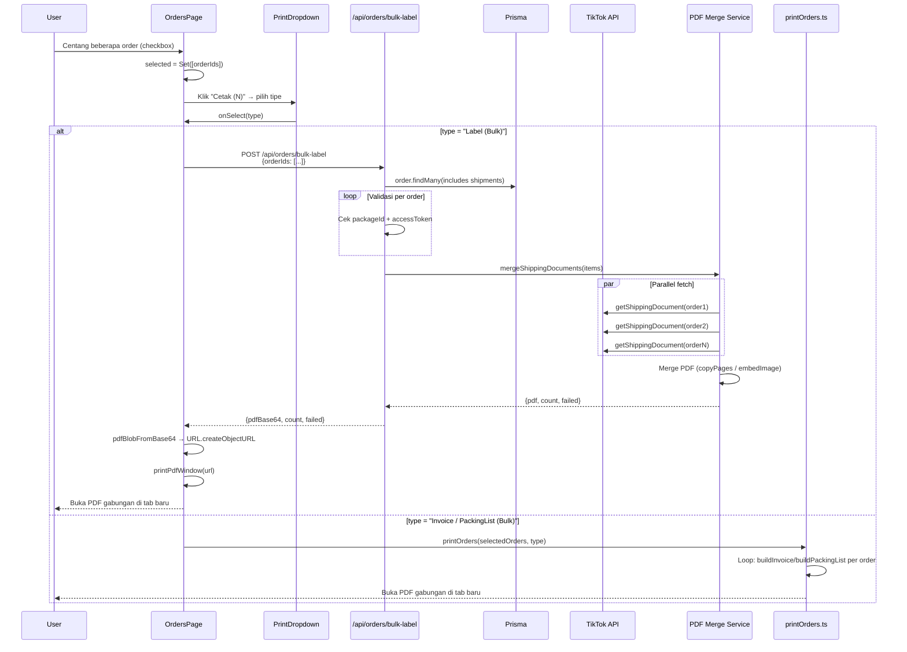
```mermaid
sequenceDiagram
    participant U as User
    participant PAGE as OrdersPage
    participant DD as PrintDropdown
    participant API as /api/orders/bulk-label
    participant DB as Prisma
    participant TT as TikTok API
    participant PDF as PDF Merge Service
    participant P as printOrders.ts

    U->>PAGE: Centang beberapa order (checkbox)
    PAGE->>PAGE: selected = Set([orderIds])
    PAGE->>DD: Klik "Cetak (N)" → pilih tipe
    DD->>PAGE: onSelect(type)

    alt type = "Label (Bulk)"
        PAGE->>API: POST /api/orders/bulk-label<br/>{orderIds: [...]}
        API->>DB: order.findMany(includes shipments)
        loop Validasi per order
            API->>API: Cek packageId + accessToken
        end
        API->>PDF: mergeShippingDocuments(items)
        par Parallel fetch
            PDF->>TT: getShippingDocument(order1)
            PDF->>TT: getShippingDocument(order2)
            PDF->>TT: getShippingDocument(orderN)
        end
        PDF->>PDF: Merge PDF (copyPages / embedImage)
        PDF-->>API: {pdf, count, failed}
        API-->>PAGE: {pdfBase64, count, failed}
        PAGE->>PAGE: pdfBlobFromBase64 → URL.createObjectURL
        PAGE->>PAGE: printPdfWindow(url)
        PAGE-->>U: Buka PDF gabungan di tab baru

    else type = "Invoice / PackingList (Bulk)"
        PAGE->>P: printOrders(selectedOrders, type)
        P->>P: Loop: buildInvoice/buildPackingList per order
        P-->>U: Buka PDF gabungan di tab baru
    end
```

### 13c. Print Document Types

| Type | Content | Source |
|---|---|---|
| **Label** | Barcode (trackingNo / orderNo), info pengiriman | TikTok official atau custom `buildLabel()` |
| **Invoice** | No. Pesanan, item list, total harga, metode bayar | `buildInvoice()` — data dari Order |
| **PackingList** | No. Pesanan, item list, barcode, qty per item | `buildPackingList()` — data dari Order |

### 13d. Label Priority Logic

```mermaid
flowchart TD
    A[User klik Cetak Label] --> B{Official label tersedia?}
    B -->|"Ya (docUrl exist)"| C[Gunakan label resmi TikTok]
    C --> D[Print PDF langsung]
    B -->|"Tidak"| E{Order detail loaded?}
    E -->|Ya| F[Generate custom label<br/>buildLabel]
    F --> G[Print PDF]
    E -->|Tidak| H[fetchOrderDetail]
    H --> I{Berhasil?}
    I -->|Ya| F
    I -->|Tidak| J[Alert: Gagal memuat data]
```

---

## 14. Order Progress Steps (Fulfillment Stages)

```mermaid
flowchart LR
    A[Picking List] --> B[Packing List]
    B --> C[Label]
    C --> D[Invoice]

    style A fill:#e0e7ff,stroke:#6366f1
    style B fill:#fef3c7,stroke:#f59e0b
    style C fill:#d1fae5,stroke:#10b981
    style D fill:#ede9fe,stroke:#8b5cf6
```

| Stage | Keterangan | Trigger |
|---|---|---|
| **Picking List** | Daftar barang untuk diambil dari gudang | Order masuk |
| **Packing List** | Daftar barang untuk dikemas | Siap kirim |
| **Label** | Label pengiriman/resi kurir | Ship package |
| **Invoice** | Faktur resmi | Cetak invoice |

---

## 15. Order Detail Navigation

```mermaid
sequenceDiagram
    participant U as User
    participant CARD as OrderCard
    participant PAGE as /orders/detail/[orderId]
    participant API as /api/orders/:id
    participant DB as Prisma
    participant PII as PII Service

    U->>CARD: Klik "Detail Pesanan"
    CARD->>PAGE: router.push(/orders/detail/orderId)
    PAGE->>API: GET /api/orders/:id
    API->>DB: order.findUnique(includes items, account, shipments)
    DB-->>API: Order + relations

    API->>PII: decryptPii(phone), decryptPii(address)
    PII-->>API: Decrypted PII

    API->>API: {canViewFullPii?}
    alt true → Full access
        API->>API: Return decrypted PII
        API->>DB: PiiAccessLog.create(READ_ORDER_DETAIL)
    else false → Masked
        API->>API: maskName, maskPhone, maskAddress
        API->>API: Return masked PII
    end

    API-->>PAGE: 200 OK + order detail
    PAGE-->>U: Tampilkan OrderDetailView
```
